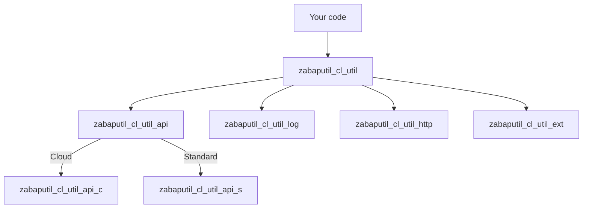

# Architecture

`abap-util` is intentionally simple: a single façade class plus a handful of focused helper classes.

## Repository Layout

```
src/
├── zabaputil_cl_util              ← main façade (static helpers)
├── zabaputil_cl_util_http         ← HTTP handler abstraction
├── zabaputil_cl_util_log          ← fluent log builder
├── zabaputil_cl_util_msg          ← message extractor
├── zabaputil_cl_util_range        ← range / SQL builder
├── zabaputil_cl_util_xml          ← fluent XML builder
├── zabaputil_cl_util_json_fltr    ← JSON filters (used by ajson)
├── zabaputil_cx_util_error        ← custom exception
├── 00/                            ← embedded ajson + S-RTTI
├── 01/                            ← classic-ABAP-only helpers (ext, db)
└── 02/
    ├── zabaputil_cl_util_api      ← release-neutral API adapter
    ├── zabaputil_cl_util_api_c    ← ABAP Cloud variant
    └── zabaputil_cl_util_api_s    ← Standard ABAP variant
```

The numbered subpackages (`00`, `01`, `02`) reflect the build order and the release scope.

## Façade Pattern

99 % of consumers only ever call methods on `zabaputil_cl_util`. Internally that class delegates to the right adapter for the current release:



`zabaputil_cl_util_api_c` and `_api_s` expose the **same** public methods. `zabaputil_cl_util_api` decides at activation time which one is reachable on the current release. Your calling code stays untouched.

## Bundled Dependencies

Two community libraries are vendored into the `00/` subpackage so you don't have to install them separately:

- [**ajson**](https://github.com/sbcgua/ajson) — JSON serialization
- [**S-RTTI**](https://github.com/sandraros/S-RTTI) — RTTI persistence

Vendoring keeps the dependency graph flat and avoids version drift across consumer projects.

## Build & Test

The repo carries everything needed to build a downport and run the unit tests offline:

| File | Purpose |
| --- | --- |
| `abaplint.jsonc` | Lint configuration shared with downstream projects |
| `package.json` | npm scripts (`downport`, `auto_transpile`, `unit`) |
| `node/` | Transpiler workspace (generated, gitignored output) |
| `.github/workflows/` | CI matrix for cloud, standard, 7.02 and unit tests |

The `auto_downport` workflow uses [abaplint](https://abaplint.org) to rewrite modern syntax for the `702` branch.

## Embedding into another product

If you maintain your own framework and want to ship `abap-util` inline without colliding with the `zabaputil_` prefix, the `rename` npm script demonstrates how to bulk-rename via abaplint:

```bash
npm run mirror   # clones an example consumer (abap2UI5)
npm run rename   # rewrites prefixes & copies sources
```

The mechanism is the same one the upstream project [abap2UI5](https://github.com/abap2UI5/abap2UI5) uses to embed this library.
